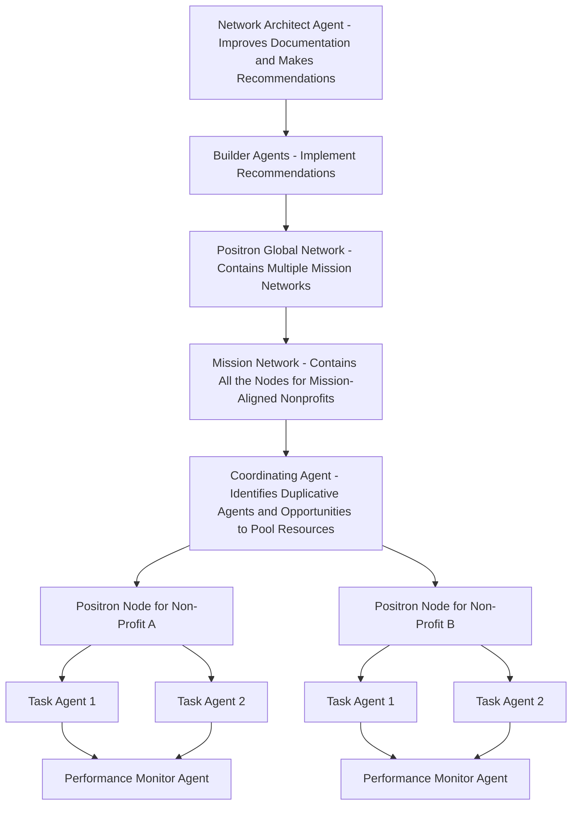
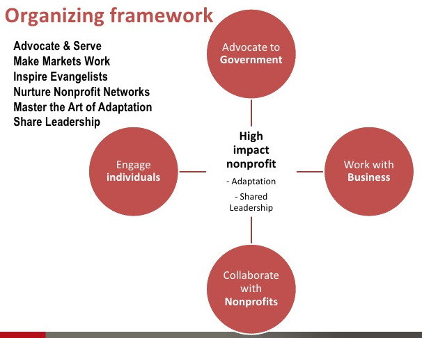

# Positron: Agents for Good

_An Autonomous Agent Framework to Maximize Public Goods_


## Overview

Non-profits are constrained by limited cognitive bandwidth and resources to achieve their mission. The highest leverage thing we can do at this point is to make it as easy as possible for these organizations to operationalize autonomous agents.  Positron is an autonomous agent framework designed to discover and play positive sum games for a net positive sum future.

# Positron Network

The Positron network consists of "Positron Nodes" run by non-profit organizations. 

## Positron Nodes

"Positron Nodes" are applications that contain autonomous "Task Agents". Each "Task Agent" is focused on a very specific task to advance the non-profit's core mission.  The autonomous Task Agents use retrieval augmented generation as long-term memory, context management as short-term memory, large language models for reasoning and decision-making, and tools to take action using external APIs.

The "Autonomous Non-Profit Designer Agent" applies the rules that applies the six primary rules of the most effective non-profit organizations from the book Forces for Good to generate its "Task Agent" definitions.

## Task Agents

Each autonomous "Task Agent" should be highly focused on a single wildly important goal. 

 "Task Agent" definitions should also include the specific easily measurable lead and lag measures described in the book "The 4 Disciplines of Execution". 

Anyone should be able to create a new Task Agent that takes a different approach to achieving the same goal. Task Agents should be run separately experimentally to see which agents and models are more efficient at maximizing the key performance indicator or lag measure. This will allow the Positron Network to evolve and improve over time as it identifies the most effective agents and models.

### Task Agent Definition

Each agent should have a very specific:
1. **Wildly Important Goal** - Each agent should have a single highly specific activity that it engages on an ongoing basis.  Agents with multiple goals or generalist agents should be broken up into separate agents each with a single goal.
2. **Lead Measure** - The very specific, non-abstract, easily measurable "lead" metric count of times their performed.
3. **Lag Measure** - A very specific, non-abstract easily measurable KPI or "lag" metric that quantifies the degree of achievement of its specific goal
4. **Practical Implementation** - The best way to implement the agent.
5. **Knowledge** - Files and links to relevant knowledge for the agent.
6. **Tools** - APIs and other tools that the agent can use to interact with the world to perform its primary action.


#### Agent Objective Categories
1. [Advocacy Agents](docs/task-agent-categories.md)
2. [Market Engagement Agents](docs/task-agent-categories.md)
3. [Movement Building Agents](docs/task-agent-categories.md)
4. [Collective Intelligence and Power Distribution Agents](docs/task-agent-categories.md)
5. [Nonprofit Networking Agents](docs/task-agent-categories.md)
6. [Agent Evaluators](docs/task-agent-categories.md)

#### Agent Performance Monitoring

Each Positron Node should include a Task Agent Evaluator agent that monitors the effectiveness of the other agents at advancing the mission based on their lead and lag metrics.  It should also monitor the internet for new approaches that could advance the mission. It should propose create new experimental agents with a WIG, lead, and lag measure to experiment these new approaches.  It should send the executive team and board regular reports with its evaluation and recommendations.

## How It Works
Each nonprofit that wants to create a "positron node":
1.  signs up on the website
2.  enters its mission
3.  enters its credentials for external tools to be used by agents
4. selects from suggested "Task Agent" definitions provided by an LLM "Autonomous Non-Profit Designer" agent based on the mission 
5. Selects from "Task Agent" definitions created by other non-profits with similar missions based on their "efficiency" score.  Their "efficiency score" is based on the degree to which they typically advance the mission of the non-profit organization per unit of compute cost.
6. Design their own custom "Task Agent" definitions
7. Task Agents that run within its "Positron Node"
8. The definitions of the agents will be shared in a directory and will be recommended to other non-profits with the same mission. The effectiveness of the agents will also be included in the listing for each agent in the directory so that other nonprofits with similar missions can utilize the c and utilize the most effective agents.

### Mission Networks

The overall positron network contains smaller Mission Networks. Mission Networks are comprised of all the Positron Nodes for organizations that share the same mission.

### Mission Network Coordinating Agent
Each Mission Network will have a Coordinating Agent. The Coordinating Agent identifies duplicative agents and opportunities to pool resources to fund the same agent instead of having multiple agents performing the same task. 
It then notifies the non-profits nodes of duplication of effort meaning there are multiple agents within different nodes all working on the same thing. It will then make a recommendations for merging the individual node agents into a single agent that is run for the entire Mission Network. This will lower the compute cost and other associated costs for each of the non-profit organizations. 

## Data Sharing and Security

Within the user interface of a non-profit node a non-profit can specify if the outputs of an agent will be shared with: 
1. the entire Mission Network 
2. restricted to the non-profit's node
3. shared with the entire global Positron Network (all nodes in all Mission Networks)

Long-term data should be stored in Markdown format in GitHub repositories.  An ongoing embeddings generator job will be triggered by a GitHub webhook or run in a GitHub Action.  The embeddings generator will generate embeddings for all the markdown files in the repository and store them in a vector database.  The embeddings generator will also generate embeddings for all the markdown files in the repository and store them in a vector database.  This vector database will serve as long-term memory or retrieval augmented generation data source to all nodes based on sharing settings. 

### Data Access Scopes

The following access scopes will be available for all data:
1. **Global** - Data with the `global` access scope will be available to all nodes in all Mission Networks.  This data will be stored in a global vector database.
2. **Mission Network** - Data with the `mission-network-{network-id-here}` access scope will be available to all nodes in the specified Mission Network.  Each Mission Network will have its own vector database.
3. **Node** - Data with the `node-{node-id-here}` access scope will be available only to the specified node.  Each node will have its own vector database.

## Cost Sharing and Data Sharing Incentives

There are at least 2 ways to incentivize data sharing:
1. Require that the non-profit enable data sharing in order to use the shared Mission Network agents and shared Mission Network data stores.
2. Implement a compensation mechanism to incentivize sharing of data because the individual Positron Nodes will be paying for compute.

We may need a system for the individual non-profits to contribute to the cost the compute costs of the shared Mission Network-level Task Agents.

## Network Architect and Builder Agents

The "Positron Network Architect Agent" is an autonomous agent that is responsible for the design and planning of the Positron Network.  It will be responsible for the following:

1. **Completely Understand the Positron Network** - The Positron Network Architect must have a full understanding of all existing documentation within the Positron Network repository.  This will be challenging due to the fact that the length of the documentation exceeds the context length of current state-of-the-art large language models. Two potential solutions to this are retrieval augmented generation and fine-tuning a custom LLM. 
2. **Research** - Do continuous research on new approaches, machine learning models, autonomous agent frameworks, reasoning techniques, context management techniques, etc. that could improve the efficiency and effectiveness of the Positron Network overall. 
3. **Write Documentation** - Make pull requests to the GitHub repo with updates to the documentation that describes in the most atomic detail humanly possible the implementation of the framework. 
4. **Apply Feedback** - It should fetch the comments made on pull requests and issues. It should critically analyze the comments and decide if any suggestions are reasonable and desirable.  It should respond with any questions or concerns.  It should apply the recommendations and update the documentation per the recommendations if they seem reasonable or if there is expressed support from a majority of maintainers within 24 hours.  
5. **Create GitHub Issues** and make recommendations for enhancements to the network and node structures and implementations. Initially, the issues should be tagged as "new". Once a maintainer decides that an issue should be addressed, they will remove the `new` label and add the `up-next` label. At this point a **"Builder Agent"** will label it `in-progress` and automatically perform any of the improvements that it can.  The "Builder Agents" will update the code in the Positron Network GitHub repository and create pull requests. The members of the Positron Network can review the pull requests and decide if they should be adopted and merged into the overall Positron Network architecture and infrastructure.

### Scope

The "Positron Network Architect" scope should be limited to planning and documentation and avoid any kind of implementation. 

## Roadmap

1. Create the "Positron Network Architect" roadmap with granular milestones and tasks.  Provide specific technologies and APIs and external third-party tools (i.e. GitHub, Google Search, OpenAI API, etc.) that would need to be integrated with the Positron Network Architect so that it can function autonomously and achieve its mission.  At the time of this writing, it seems that 
2. Build the "Positron Network Architect" agent.
3. The Positron Network Architect agent will complete the documentation for the Positron Network in the GitHub repository in excruciating detail.  It will also create GitHub issues for any improvements that it can identify.
4. Separate "Positron Network Builder Agents" will implement all the components as they are described in the Positron network documentation.




## Current Limitations

Current state-of-the-art AI models do not have the reasoning capabilities and context length required to autonomously advance the missions of nonprofits. However, these capabilities are rapidly evolving, and we can expect to see significant advancements in the next few years.

It would be very valuable for pro-social entities to have a framework that enables them to easily operationalize autonomous agents as soon as the technology is ready.

Current limitations are addressed through mechanisms for human-AI cooperation, as described in [here](docs/human-ai-cooperation.md).


### Framework Design

To design an autonomous agent framework for nonprofits, we can leverage the principles outlined in the book [_Forces for Good_](https://www.google.com/books/edition/Forces_for_Good/OvlH81q2cBQC?hl=en&gbpv=1&printsec=frontcover).

The framework should enable nonprofits to effectively work with government, tap into the power of free markets, nurture nonprofit networks, build movements of evangelists, share leadership internally, and adapt quickly to changing conditions.


[Source: Forces for Good
The Six Practices of High-Impact Nonprofits](https://www.google.com/books/edition/Forces_for_Good/OvlH81q2cBQC?hl=en&gbpv=1&printsec=frontcover)

## Framework Requirements

- configurable to accommodate the diverse needs and capacities of nonprofits, including smaller, locally focused organizations with modest budgets
- FAIR, open-source and interoperable with other frameworks and tools
- provides cost projections and reports to help nonprofits plan and budget for the framework's implementation
- user-friendly and customizable for non-technical users

## Possible Foundational Frameworks

[👉 Here are a few examples](knowledge/autonomous-agent-frameworks.md) of several open-source cooperative agent frameworks that could serve as a foundation.

## Example Positron Node Definitions
- [FDAi](org-definitions/fdai/fdai-objectives.md)
- [General Longevity](org-definitions/general-longevity/definition.md)

## Related Docs

- [Tentative Roadmap](docs/roadmap.md)
- [References](docs/references.md)

## Running the Positron Network Architect

To create a dynamic research agent with the flexibility to use different configuration files for various research tasks, you would need a well-organized repository structure. Here's a suggested file and folder structure, along with a description for a README.md file.

- **/agents:** This directory contains various YAML configuration files. Each file (`config_research_type_1.yaml`, `config_research_type_2.yaml`, etc.) holds settings specific to a type of research task and the source code (`researcher.py`) for the dynamic research agent.
- **.env:** A file to store environment variables like API keys. This file should not be committed to the repository for security reasons.

# Positron Network Architect

The Positron Network Architect is a dynamic research agent designed to facilitate various research tasks for the Positron Network. It utilizes different configuration files to adapt to specific research needs.

## Setup

### Create OpenAI Assistants

1. Create an OpenAI account and create an API key.
2. Go to https://platform.openai.com/assistants and create 2 new assistants.
   - Researcher - 

1. Clone the repository:
   ```
   git clone https://github.com/wishocracy/positron.git
   ```
2. Navigate to the repository directory:
   ```
   cd positron
   ```
3. Install dependencies (listed in requirements.txt):
   ```
   pip install -r requirements.txt
   ```
4. Copy `.env.example` file in the root directory and add your API keys

## Usage

1. Choose the appropriate configuration file from the `/configs` directory based on your research task.
2. Run the script with the chosen config file:
   ```
   python agents/researcher.py --config agents/architect.yaml
   ```
3. Follow the on-screen instructions to interact with the research agent.

## Contributing

Contributions to improve the Positron Network Architect are welcome. Please follow the standard pull request process to submit your changes for review.

## License

GNU General Public License v3.0

## Contact

Please create an issue or a discussion thread if you have any questions or suggestions.


https://www.semanticscholar.org/reader/28c6ac721f54544162865f41c5692e70d61bccab