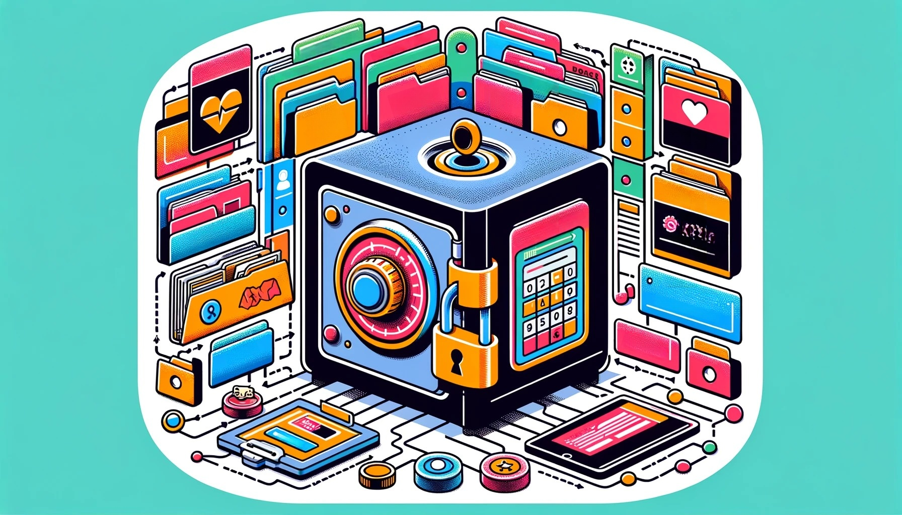

# Digital Twin Safe Product Requirements

This outlines the requirements for a tool to allow people to create and manage their [digital twin](digital-twins.md). The platform will leverage automation, API integration, and AI to streamline the digital twin creation process.

### High-Level Requirements
1. **Collecting Training Data:**
   - Anyone should be able to automatically generate a digital twin by:
      - importing data via APIs (Google Drive, OneDrive, Notion, and various health apps and wearables)
      - through web research AI agents that collect 
      - manual uploading data through a web interface
      - editing files using tools like [Obsidian](https://obsidian.md/)
   - Scheduled data imports from Google Drive, OneDrive, Notion, and various health apps and wearables.
   - Utilize Next.js and NextAuth for the framework and authentication.
   - NextAuth has built-in support for authentication and importing data from:
     - Google Drive
     - Gmail
     - Google Calendar
     - Google Contacts
     - Google Sheets
     - Google Tasks
     - OneDrive
     - Notion
     - Slack
     - Twitter
     - Spotify
     - Strava
     - Fitbit
     - GitHub
     - GitLab
     - Facebook
     - Discord
     - Instagram
     - LinkedIn
     - Reddit
     - Dropbox
     - WordPress
     - Whatever else people use
   - URLs: 
     - Overview: https://{username}.wishonia.ai/admin/add-connector
     - Specific Connection Management Page: https://{username}.wishonia.ai/admin/admin/connectors/{connector_name}

2. **Chat Interface to Directly Talk to Your Digital Twin:** 
   - a chat UI at https://{username}.wishonia.ai/chat to interact with their digital twin
   - In order to preserve privacy and control costs, the analog twin should be able to configure access control or paywall for their digital twin chat.

3. **An API for Other AI or Apps to Talk Your Digital Twin**
   - Your Digital Twin's API is an easy way for AI agents to interact with your digital twin.
   - This API would also be used to power:
     - the chat UI
     - your character in virtual worlds like Smallville, Minecraft, and Roblox
   - Enable users to sign up for an API key to communicate with their digital twin.
   - Incorporate usage monitoring and Stripe integration for billing.
   - URL: https://{user_name}.wishonia.ai/api

4. **API Registration Portal**
    - Allow external users to sign up and interact with your digital twin's API.
    - 
    - URL: https://{user_name}.wishonia.ai/api/register

5. **API Documentation:**
   - Provide interactive OpenAPI documentation using Swagger UI, Mintlify, Readme.io, or something
   - URL: https://{user_name}.wishonia.ai/api/docs

6. **SDKs To Allow Your Digital Twin to Interact with Applications in Any Language**
   - This allows developers to include Digital Twins in their own applications (or virtual worlds) with minimal effort.
   - SDKs can be auto-generated from the OpenAPI specification using GitHub actions.
   - SDKs require API keys to access the Digital Twin API

7. **OAuth2 Server Integration:** 
   - Allow users to grant third-party applications access to their Digital Twin data.

8. **User-Specific URLs:** 
   - Wishonia should be a multi-tenant application where everyone gets their own subdomain like https://{username}.wishonia.ai/
   - Below this subdomain are all the paths listed in the [Digital Twin Safe Site Map](dts-site-map.md) including the chat UI, API, API documentation, API registration portal, billing management, etc.

1. **Git Repository Synchronization:** 
   - Your safe will sync user data to their Digital Twin GitHub repository in markdown and CSV formats.  
   - The benefits of storing data in a GitHub repository are:
      - Version control
        - Users can easily revert to previous versions of their data if necessary.
      - Collaboration
        - For Digital Twins of organizations, teams can contribute to a shared data repository with fine-grained access controls.
      - Openness
      - Portability
        - By being able to easily clone the repository anywhere, it can be easily used in other systems without having to deal with API integrations.
      - Security
        - GitHub has heavy built-in security features and fine-grained access controls
      - Automation
        - Automatically update vector database embeddings when data is added or changed using a GitHub action
      - **URL:** https://{username}.wishonia.ai/admin/git-sync

2. **Manually Defining Digital Twin Properties:** 
   - People need to be able to customize their digital twin's properties listed in the [Digital Twin Data Model](digital-twin-data-model.md)

3. **Review and Editing/Improving Responses**
     - people should be able to see a history of all the questions anyone has asked their digital twin and the responses it gave
     - they should be able to edit responses to specific questions in the question/answer history
     - their edits should be saved in the git repository and used to improve the digital twin's responses in the future

4. **Privacy Settings:**
   - Provide robust privacy controls for users to manage who can access their digital twin and what data is shared.
   - Create multiple personas for your digital twin to interact with different groups of people with access to different "collections" of data

5. **Notification System:**
   - Implement notifications for
     - important updates
     - scheduled data imports
     - API usage alerts
     - billing
     - import errors
     - handoffs to the analog twin for specific types of questions or people

6. **User Support and Tutorial:**
   - Include a help section with tutorials on creating and managing digital twins, and a support system for user inquiries.

7. **Feedback Mechanism:**
   - Users speaking to the digital twin in the chat UI should be able to thumbs up or thumbs down responses.  These ratings should be able to be applied to improve future responses using reinforcement learning.
   - The analog twin should be able to review all previous conversations and provide superior responses which will be incorporated and heavily weighted in training data or vector DB search rankings. 
   - users to provide feedback on the platform, contributing to continuous improvement.

8. **Mobile Responsiveness:** 
   - Ensure that the web interface is fully responsive and accessible on various devices, including tablets and smartphones.

## Learn More
- [Why Digital Twins?](why-digital-twins.md) 
- [How to Create a Digital Twin](how-to-build-a-digital-twin.md)
- [Digital Twin Safe](digital-twin-safe.md)
  - [Site Map](dts-site-map.md)
- [Data Sources](digital-twin-data-sources.md)
- [Data Model](digital-twin-data-model.md)
