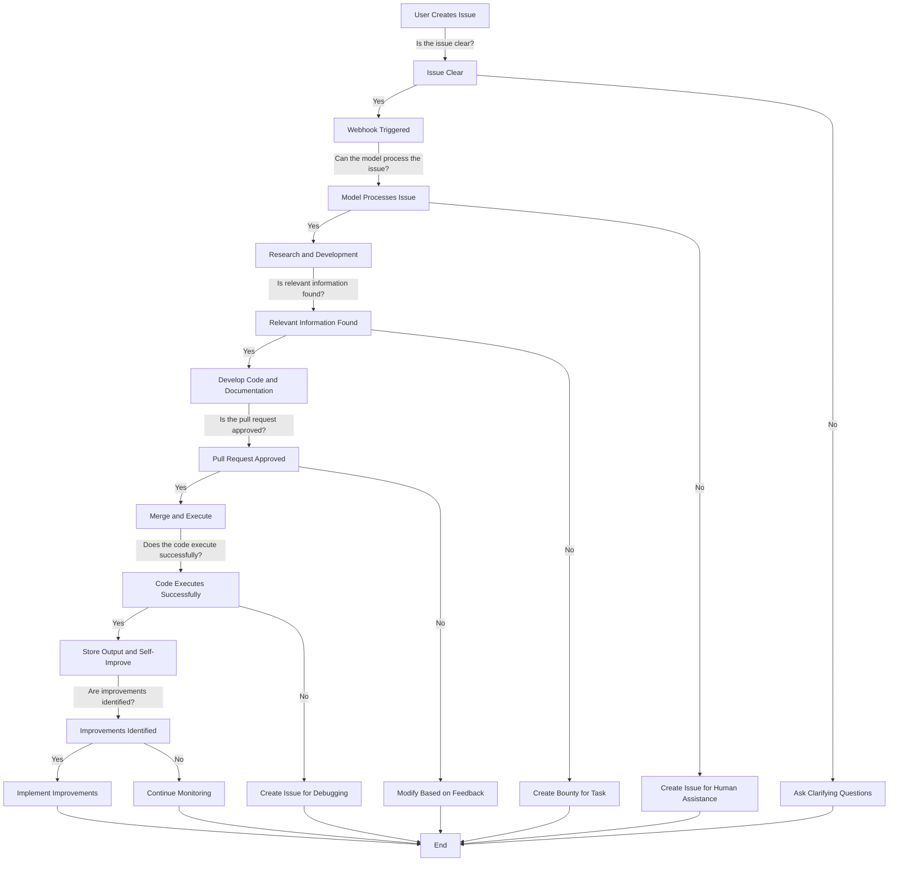

# Self-Improving GitHub Repository

The goal is to turn this project is to create a self-improving GitHub repository. 

Humans can guide and control the direction by contributing to the documentation, creating/commenting on GitHub issues, and reviewing/merging pull requests.

However, the Project Manager Agent will continuously monitor the state of the code and create issues to address any functional deficiencies.  These issues can be addressed through code contributions by Builder Agents.

Humans review the code contributions and can reject, request changes, or merge them into the main branch if they are acceptable.

## Decision Tree

Here's a simplified version of the decision-making process at each stage,
considering various uncertainties and limitations:

1. **User Creates Issue**
    - **Is the issue clear?**
        - Yes: Proceed to webhook.
        - No: Ask clarifying questions.

2. **Webhook Triggered**
    - **Can the model process the issue?**
        - Yes: Conduct research and development.
        - No: Create an issue for human assistance.

3. **Research and Development**
    - **Is relevant information found?**
        - Yes: Develop code and documentation.
        - No: Create a bounty for the task.

4. **Create Pull Request**
    - **Is the pull request approved by humans?**
        - Yes: Merge and execute.
        - No: Modify based on feedback.

5. **Merge and Execute**
    - **Does the code execute successfully?**
        - Yes: Store output and analyze for self-improvement.
        - No: Create an issue for debugging.

6. **Continuous Self-Improvement**
    - **Are improvements identified?**
        - Yes: Implement improvements.
        - No: Continue monitoring.

7. **Handling Limitations**
    - **Can the system address its limitations?**
        - Yes: Implement solutions.
        - No: Seek human developer intervention.

### Decision Tree Diagram



## Agent Types

### Project Manager Agent

The Project Manager Agent is responsible for monitoring the state of the code
and creating issues to address any functional deficiencies.
These issues can be addressed through code contributions by Builder Agents.

Humans review the code contributions and can reject, request changes,
or merge them into the main branch if they are acceptable.

### Builder Agent

The Builder Agent is responsible for creating code contributions to address issues created by the Project Manager Agent.

### Architect Agent

The Architect Agent is responsible for creating new issues for the Project Manager Agent to address.
These issues should be related to the overall architecture of the project.

### Researcher Agent

The Researcher Agent is responsible for creating new issues for the Project Manager Agent to address.
These issues should be related to the research and development of new features.

### Human Agent

The Human Agent is responsible for creating new issues for the Project Manager Agent to address.
These issues should be related to the need for human assistance.

## Structure

Creating an initial file and folder structure for your self-improving GitHub repository is crucial
for organizing the project and setting the groundwork for future autonomous development.
Here's a proposed structure along with essential files and directories:

```
self-improving-repo/
│
├── .github/
│   ├── workflows/           # GitHub Actions workflows
│   │   ├── issue_handling.yml  # Workflow for handling new issues
│   │   └── pr_review.yml       # Workflow for pull request review
│   └── templates/           # Issue and PR templates
│       ├── bug_report.md
│       └── feature_request.md
│
├── agents/                 # Autonomous agents
│   ├── issue_reader/       # Agent for reading and analyzing issues
│   ├── research_agent/     # Agent for conducting web research
│   └── pr_creator/         # Agent for creating pull requests
│
├── src/                    # Source code for the project
│   ├── utils/              # Utility scripts and modules
│   ├── main.py             # Main application script
│   └── requirements.txt    # Python dependencies
│
├── tests/                  # Test cases for the agents and other code
│   ├── agent_tests/
│   └── integration_tests/
│
├── docs/                   # Documentation
│   ├── setup.md            # Setup instructions
│   ├── usage.md            # Usage guide
│   └── contribution.md     # Contribution guidelines
│
├── .gitignore              # Git ignore file
├── LICENSE                 # License file
└── README.md               # Readme file
```

### Initial Tasks to Set Up the Repository:

1. **Set Up GitHub Workflows:** Create the `.github/workflows` directory and add workflows for issue handling and pull request review.

2. **Issue and PR Templates:** Design templates for bug reports and feature requests in `.github/templates`.

3. **Develop Autonomous Agents:**
    - **Issue Reader:** Build an agent to read and analyze incoming issues.
    - **Research Agent:** Develop an agent for web research based on issues.
    - **PR Creator:** Create an agent to automatically generate pull requests.

4. **Source Code:** Initialize the `src` directory with main application scripts and utility modules.

5. **Testing:** Write test cases for agents and other functionalities in the `tests` directory.

6. **Documentation:** Prepare comprehensive documentation including setup, usage, and contribution guidelines in the `docs` directory.

7. **Initialize Repository:** Add `.gitignore`, `LICENSE`, and `README.md` to the root directory.

By setting up this structure and completing these initial tasks,
you'll lay a solid foundation for the repository to evolve and improve autonomously over time.

## More Details
1. [Architect Agent](positron-network-architect-agent/positron-network-architect-agent.md)

## Related Projects

See [references.md](references.md#autonomous-code-generation)