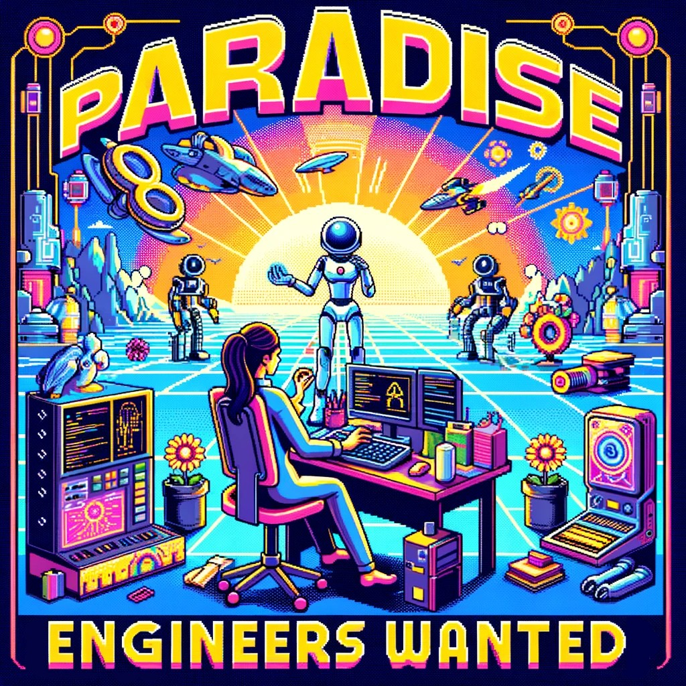

## Your Mission

Create a forkable virtual world filled with pro-social AI agents that maximize universal wish fulfillment while respecting the basic rights of meat.

## Just 3 Easy Steps!

Although this sounds like a daunting task, it can be broken down into three simple steps:

### 1. Learn

Fortunately, the Learn phase is fairly straightforward and technically feasible today.  We just need to create **Digital Twins** of real-world entities and populate them with data.

These entities primarily fall into two categories:
- **organizations** - nonprofits, governments, companies, etc.
- **people** - scientists, employees, doctors, patients, etc.

Each of these digital twins should have its own vector database of defining data.  The most fundamental components of each entity would be its:
- **wishes** - goals, desires, objectives, etc.
- **resources** - data, humans, capital, etc. that can be allocated, pooled, or exchanged with other entities to fulfill wishes.

These digital twins serve primarily as an easy source of information for other agents (deciders and actors).

## 2. Plan

**Planning Agents** that create hypotheses about the most efficient ways to fulfill various wishes while respecting universal human rights. These **Decider Agents** then use semi-quantitative cost benefit analysis to decide which strategies seem most promising.

Humans can then review these strategies and decide which ones to test.  Once a strategy is selected, the **Planning Agents** can then create **Actor Agents** to carry out the strategies.

Your work will directly contribute to creating a world of abundance, peace, and universal well-being. You'll be at the forefront of AI development, working on groundbreaking technologies and concepts that could redefine our society. (If you like that kind of thing?)

## How to Apply

Make a radical improvement to [this repository](https://github.com/wishocracy/positron) and submit a pull request. 

Then email [hello@crowdsourcingcures.org](mailto:hello@crowdsourcingcures.org) with a link to your pull request and tell us why you have what it takes to become a paradise engineer!

For more information on the responsibilities of a Paradise Engineer, see [Paradise Engineer Responsibilities](paradise_engineer_responsibilities.md).
For more information on the skills and experience required, see [Paradise Engineer Skills and Experience](paradise_engineer_skills_experience.md).
To apply for the Paradise Engineer position, see [Paradise Engineer Application](paradise_engineer_application.md). 

Then email [hello@crowdsourcingcures.org](mailto:hello@crowdsourcingcures.org) with a link to your pull request and tell us why you have what it takes to become a paradise engineer!
