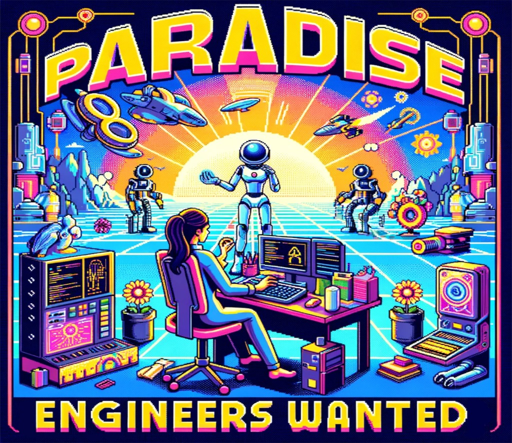

## Your Mission

Create a forkable virtual world filled with pro-social AI agents that maximize universal wish fulfillment while respecting the basic rights of meat.

## Just 3 Easy Steps!

Although this sounds like a daunting task, it can be broken down into three simple steps:

### 1. Learn

Fortunately, the Learn phase is fairly straightforward and technically feasible today.  We just need to create **Digital Twins** of real-world entities and populate them with data.

These entities primarily fall into two categories:
- **organizations** - nonprofits, governments, companies, etc.
- **people** - scientists, employees, doctors, patients, etc.

Each of these digital twins should have its own vector database of defining data.  The most fundamental components of each entity would be its:
- **wishes** - goals, desires, objectives, etc.
- **resources** - data, humans, capital, etc. that can be allocated, pooled, or exchanged with other entities to fulfill wishes.

These digital twins serve primarily as an easy source of information for other agents (deciders and actors).

## 2. Plan

**Planning Agents** that create hypotheses about the most efficient ways to fulfill various wishes while respecting universal human rights. These **Decider Agents** then use semi-quantitative cost benefit analysis to decide which strategies seem most promising.

Humans can then review these strategies and decide which ones to test.  Once a strategy is selected, the **Planning Agents** can then create **Actor Agents** to carry out the strategies.

## 3. Act

**Actor Agents** then carry out plans and measure the results.  Given current their limitations, **Actor Agents** should:
1. automate what they can, using tools 
2. outsource what they can't to humans by creating bounties

### Key Responsibilities

- **AI Agent Development:** Create and refine proof-of-concept AI agents using existing [autonomous agent frameworks](../../knowledge/autonomous-agent-frameworks.md) (e.g., AutoGen, TaskWeaver, ChatDev, MetaGPT). Ensure these agents can simulate real-world scenarios and decisions for optimal societal outcomes.
- **API & Framework Expertise:** Develop robust APIs and work with OpenAPI specifications. Utilize frameworks such as Next.js and React for scalable, efficient applications.
- **Documentation & Support:** Produce comprehensive documentation to assist users and contributors in understanding and utilizing AI agents.
- **Community Engagement:** Organize and lead supportive events and meetings for contributors, fostering a collaborative environment.
- **Project Management:** Regularly update on project progress, strategize future developments, and navigate potential obstacles. Coordinate with various organizations and contributors for seamless integration and progress.
- **Hackathon Coordination:** Plan and execute hackathons focusing on specific [autonomous agent frameworks](../../knowledge/autonomous-agent-frameworks.md), guiding participants in creating diverse AI agents for public good projects.

### Skills and Experience

- **Technical Expertise:** Proven experience in creating APIs, OpenAPI specifications, and working with frameworks like Next.js and React.
- **AI and Machine Learning:** Experience in fine-tuning and deploying open-source AI models, including large language models. Familiarity with [autonomous agent frameworks](../../knowledge/autonomous-agent-frameworks.md) such as AutoGen, TaskWeaver, ChatDev, and MetaGPT.
- **Open Source Contributions:** A history of significant open-source contributions, showcasing your skills and collaborative nature.
- **Communication and Leadership:** Strong communication skills for effective documentation, meetings, and collaborative projects. Leadership experience in guiding teams and managing complex projects.
- **Ethical AI and Data Privacy:** Knowledge of ethical AI practices and data privacy regulations to ensure responsible development and deployment.
- **Problem-Solving and Adaptability:** Ability to navigate and solve complex technical challenges in a rapidly evolving field.
- **Passion for Social Impact:** A deep interest in using technology for societal betterment, aligning with the vision outlined in [Gaming the Future](https://foresightinstitute.substack.com/p/start-here).

**Why Join Us:**

Your work will directly contribute to creating a world of abundance, peace, and universal well-being. You'll be at the forefront of AI development, working on groundbreaking technologies and concepts that could redefine our society. (If you like that kind of thing?)

## How to Apply

Create a pro-social agent that improves the world using [an agent framework](../agent-frameworks.md) and [submit a pull request](https://github.com/wishocracy/positron). 

Since reasoning capabilities are still limited, you might want to focus on the first "Learn" phase and create a **Digital Twin** of an organization or person.  

More details and submission guidelines are available in the [Collabathon Instructions](../collabathons/collabathons.md).

Here are some other [ideas for possible agents as well](../agent-ideas).

Then email [hello@crowdsourcingcures.org](mailto:hello@crowdsourcingcures.org) with a link to your pull request and tell us why you have what it takes to become a paradise engineer!
