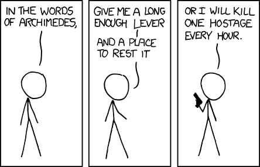
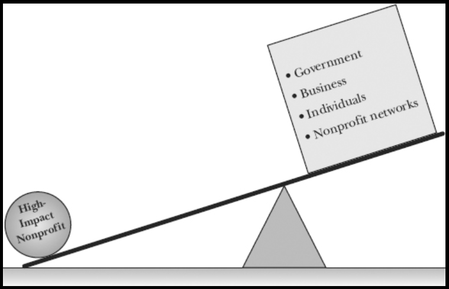
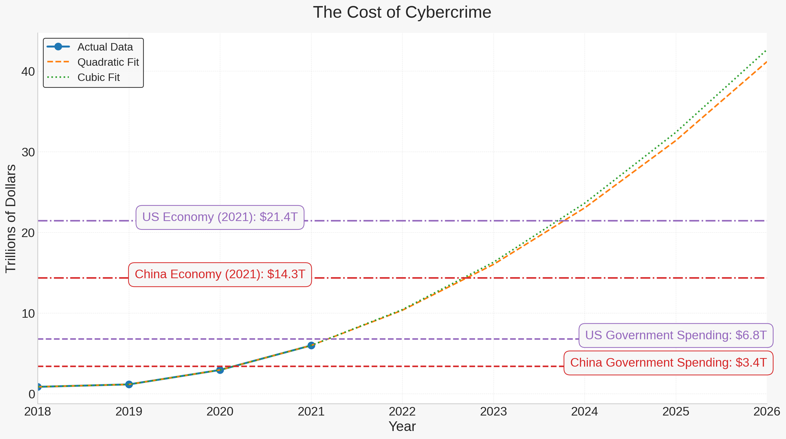

### Maximizing Leverage for Good

Compressed into a word, what separates effective non-profits from ineffective ones is leverage.

The highest leverage thing anyone can do at this point is to make it as easy as possible for pro-social entities to accelerate their mission through autonomous agents.

### Isn't This Dangerous?

Regardless of what we do, cybercriminals and authoritarian governments will continue to use AI for antisocial purposes.  The only thing we can do is attempt to shift the balance of power in favor of pro-social entities.

Anti-social entities like cybercriminal organizations are already using AI to automate their operations and maximize their impact. Even without autonomous agents, parasitic cybercriminals are extracting more and more value from the productive economy which makes pro-social non-profits possible.  The cost of cybercrime is projected to reach [$10.5 trillion annually by 2025](https://www.forbes.com/sites/forbestechcouncil/2023/02/22/105-trillion-reasons-why-we-need-a-united-response-to-cyber-risk/?sh=aa441d13b0c4), which is more than the GDP of any country except the US and China.

If the exponential trend continues, the parasite could kill its host by extracting more value than the host can produce. Governments currently apprehend a tiny percentage of cybercriminals, so it's unlikely that they will be able to stop this trend.

Governments are [spending billions](https://www.marketsandmarkets.com/Market-Reports/artificial-intelligence-military-market-41793495.html) on "slaughter bots" and other autonomous weapons as well as [mass surveillance](https://www.wired.com/story/ai-surveillance-cameras-europe/).

#### Primary Objective Functions: Tilting the Balance of Power to a Positive Future

More than changing human trajectories, super-intelligence is likely to amplify existing trends by optimizing for the primary objective functions of existing entities.
Although people have myriad motivations, there is generally a primary objective function that is most characteristic of each group.

1. **Criminals** - Drain maximum resources from the cooperative productive economy.  AI is perfectly suited for cybercrime and will allow cybercriminals to effectively clone themselves a million times over.
2. **Politicians** - Maximize power.  Obviously, there are wonderful people with wonderful intentions in government.  However, decency can be a major disadvantage in politics.  The dark triad traits, which include Machiavellianism, psychopathy, and narcissism, have been found to be [far more predictive](https://www.frontiersin.org/articles/10.3389/fpos.2021.657750/full) of political power attainment.
3. **Corporations** - Maximize profits. This can be good in the sense that it incentivizes the creation of products and services that people want.  However, the most profitable thing a company can do is get government subsidies. ROI of corporate lobbying can be as high as [22,000%](https://www.freshonomics.org/blog/2021/3/14/the-logic-of-lobbying-how-do-you-turn-58-billion-into-44-trillion) compared to free market profit margins around [10%](https://www.capterra.com/resources/what-is-good-profit-margin-for-small-business/).
4. **Nonprofits** - **Maximize global health and happiness** (in a very general sense on average).

So only one of these entities has a primary objective function that is aligned with the interests of humanity as a whole.  Unfortunately, the non-profit sector isn't generally known for its efficiency.

#### AI Arms Race Conditions

There's not much we can do to reduce autonomous AI adoption by cybercriminals and authoritarian governments and the inevitable harm that results. So despite the risks associated with autonomous agents, it's critical that we weight humanity's trajectory in favor of the most positive objective functions.