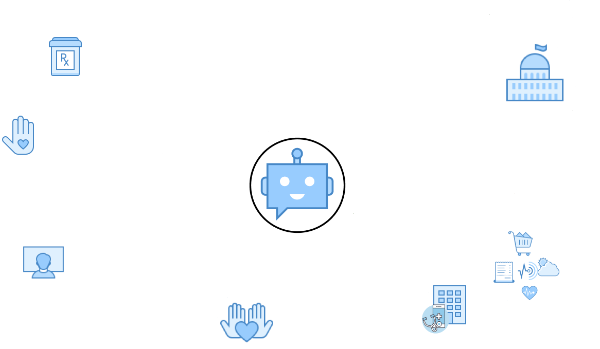

## FDAi-Specific Autonomous Agent Framework

Applying these principles specifically to the FDAi framework would entail the following elements and functions:

1. **Serve Individuals and Advocate on Their Behalf:**
- **Data Collection and Analysis Module:** This module helps individuals collect and analyze personal data to uncover factors affecting their health, especially in areas like dementia or mental illness. It uses AI to identify patterns and risk factors from the collected data.
- **Policy Advocacy Interface:** Interfaces with government portals to submit policy change requests and resource allocation proposals based on the data analysis.

2. **Make Markets Work:**
- **Market Integration Module:** Develops partnerships with businesses (like pharmacies, online grocers, healthcare providers) for data exchange and service provision. It should have capabilities to analyze market trends and suggest potential partnerships or business models, like software development or data analysis services.
- **Business Collaboration Toolkit:** Facilitates collaboration with businesses, aligning nonprofit goals with corporate social responsibility initiatives.

1. **Inspire Evangelists:**
- **Community Engagement Engine:** This part of the framework manages volunteer databases, rewarding citizen scientists and researchers. It uses gamification strategies to engage users, tracking and rewarding contributions.
- **Evangelist Development Program:** Develops training modules and engagement strategies to convert supporters into active evangelists.

4. **Building Non-Profit Networks:**
- **Open Source Software Development Kit:** Provides tools and templates for other nonprofits to use in data collection and analysis.
- **Affiliate Network Coordinator:** Manages and supports local affiliate groups, fostering collaboration among patients, physicians, researchers, data scientists, and programmers.

5. **Master the Art of Adaptation:**
- **Adaptive Learning System:** Continuously analyzes the effectiveness of various strategies and adapts them based on feedback and changing circumstances. It learns from successes and failures to refine approaches.
- **Innovation Lab:** A virtual space for testing new ideas and methodologies, allowing for controlled experimentation.

6. **Share Leadership:**
- **Distributed Leadership Platform:** Distributes decision-making powers across the organization and network. Includes tools for collaboration, consensus-building, and conflict resolution.
- **Leadership Development Module:** Focuses on building leadership skills throughout the organization, including training programs for upcoming leaders and boards.
